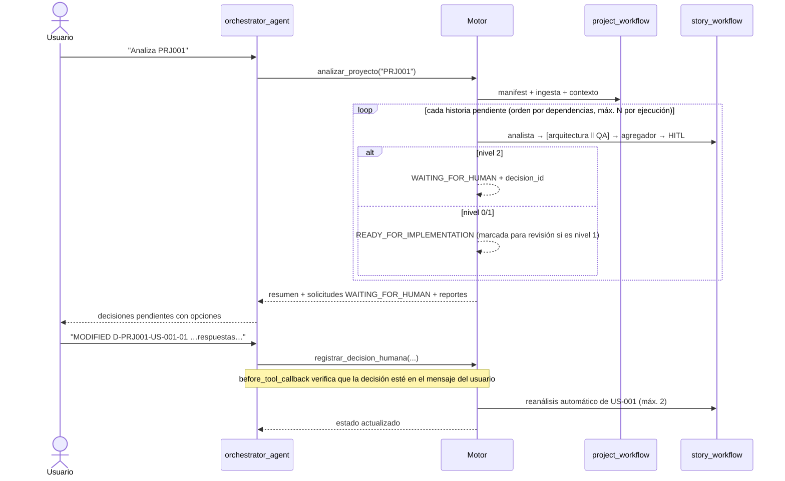
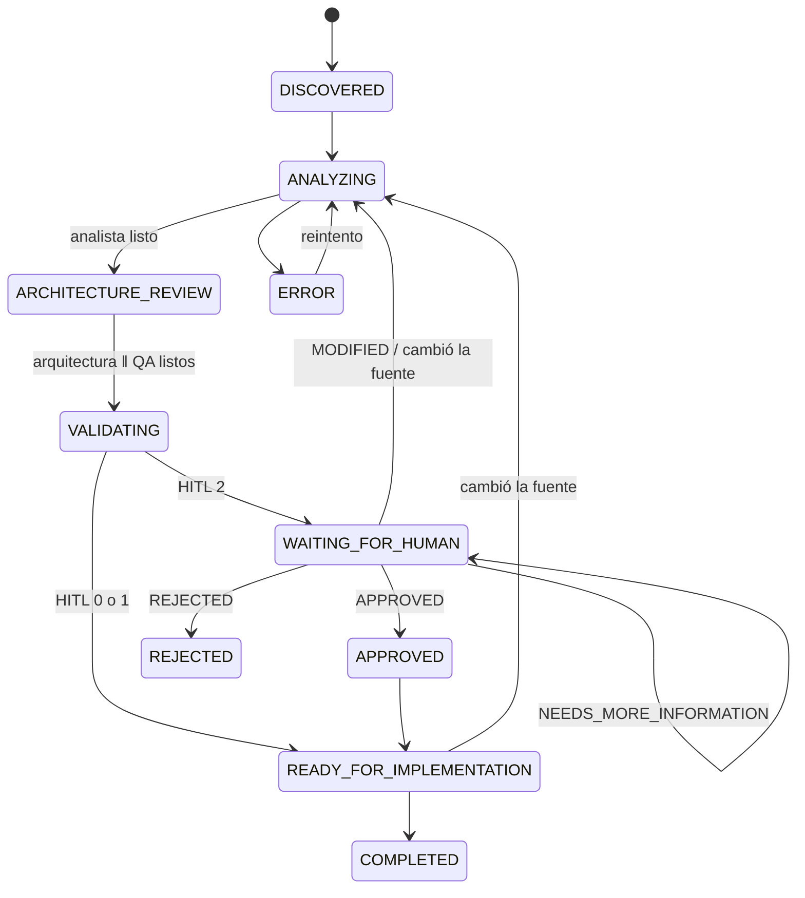
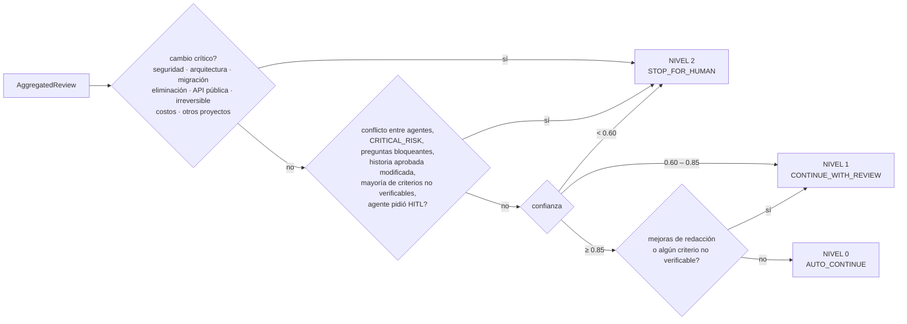

# Arquitectura multiagente para el análisis de historias de usuario

> **Automatizar cuando es seguro. Revisar cuando hay incertidumbre. Detenerse cuando es crítico.**
> Los agentes recomiendan, el orquestador controla, el humano autoriza las decisiones críticas y toda acción queda auditada.

Este documento describe el MVP implementado en `src/hu_multiagent/` y expuesto en ADK Web como la app **`orquestador_hu`**.

## 1. Vista general

```mermaid
flowchart TB
    U([Usuario en ADK Web]) <--> O[orchestrator_agent<br/>LLM conversacional]
    O -- herramientas de control --> E{{Motor de orquestación<br/>workflows/engine.py}}

    subgraph PW[project_workflow · SequentialAgent]
        D[project_discovery_agent<br/>determinista] --> I[document_ingestion_agent<br/>determinista]
    end

    subgraph SW[story_workflow · SequentialAgent, una vez por historia]
        A[story_analyst_agent<br/>LLM] --> P
        subgraph P[parallel_review · ParallelAgent]
            AR[architecture_agent<br/>LLM]
            QA[qa_agent<br/>LLM]
        end
        P --> AG[review_aggregator_agent<br/>determinista]
        AG --> H[hitl_evaluator_agent<br/>determinista]
    end

    E --> PW
    E --> SW
    E <--> ST[(StateService<br/>máquina de estados)]
    E --> AU[(AuditService<br/>JSONL + Cloud Logging)]
    E --> RS[(Resultados<br/>projects/ID/generated)]
    IN[(gs://adk_ing/projects<br/>entrada, solo lectura)] --> PW
    A & AR & QA -. Vertex AI .-> G[Gemini]
```



**Tres capas:**

1. **Conversación.** `orchestrator_agent` es el único agente con el que habla el usuario. No analiza historias: interpreta la intención y llama a herramientas de control (`descubrir_proyectos`, `analizar_proyecto`, `estado_proyecto`, `listar_decisiones_pendientes`, `registrar_decision_humana`, `explicar_historia`).
2. **Control determinista.** El motor (`HuEngine`) aplica el orden de los pasos, la máquina de estados, los límites de iteración, los reintentos, la pausa y la reanudación HITL, el versionado y la auditoría. Ni el LLM del orquestador ni los especialistas pueden saltarse pasos.
3. **Especialistas.** Son agentes ADK nativos que corren dentro de `SequentialAgent` y `ParallelAgent`. Los que necesitan juicio usan Gemini con salida validada por Pydantic. Los que aplican reglas son `BaseAgent` deterministas.

### Por qué algunos agentes son deterministas

Clasificar rutas, extraer texto, combinar revisiones y aplicar una política HITL no requiere un LLM. Hacerlo en código es más barato, reproducible y auditable, y elimina la posibilidad de alucinar en esos pasos. Los LLM se reservan para lo que exige criterio: análisis de la historia, impacto técnico y diseño de pruebas.

### Por qué el orquestador no usa transferencias libres

Con `sub_agents` y transferencia, el LLM decide cuándo y a quién ceder el control. Aquí los especialistas tienen `disallow_transfer_to_parent/peers=True` y solo corren dentro de flujos que ejecuta el motor. Así se cumple que *ningún agente se transfiera tareas sin autorización del orquestador*.

## 2. Agentes

| Agente | Tipo | Entrada | Salida | Prompt / lógica |
|---|---|---|---|---|
| `orchestrator_agent` | LLM + herramientas | mensaje del usuario | respuesta + llamadas a herramientas | `agents/orchestrator/prompt.py` |
| `project_discovery_agent` | `BaseAgent` | carpeta del proyecto | `ProjectManifest` | `agents/project_discovery/` |
| `document_ingestion_agent` | `BaseAgent` | manifest | `NormalizedDocument[]`, `UserStory[]`, `ProjectContext` | `agents/ingestion/` |
| `story_analyst_agent` | LLM (`StoryAnalysisOutput`) | historia + contexto | INVEST, ambigüedades, preguntas, propuesta | `agents/story_analyst/prompt.py` |
| `architecture_agent` | LLM (`ArchitectureReviewOutput`) | historia + análisis + contexto | impactos, cambios críticos, estado | `agents/architecture/prompt.py` |
| `qa_agent` | LLM (`QATestOutput`) | historia + análisis + contexto | casos Given/When/Then, criterios no verificables | `agents/qa/prompt.py` |
| `review_aggregator_agent` | `BaseAgent` | las tres revisiones | `AggregatedReview` (contrato común + conflictos) | `agents/aggregator/agent.py` |
| `hitl_evaluator_agent` | `BaseAgent` | revisión agregada | `HitlEvaluation` (nivel 0/1/2) | `agents/hitl_evaluator/policy.py` |

**Fase 2** (no implementados en el MVP): `security_agent`, `requirements_validator_agent` y `estimation_agent` se agregan a `parallel_review` (una línea cada uno en `workflows/story_workflow.py`). `dependency_agent` corre a nivel de proyecto, después de todas las historias. `documentation_agent` (LLM) reemplaza el reporte determinista y `project_context_agent` (LLM) resume el contexto conservando fuentes. Los estados `DEPENDENCY_ANALYSIS`, `ESTIMATING` y `TEST_GENERATION` ya existen en la máquina de estados, y la política HITL ya reconoce cambios de seguridad, costos e impacto en otros proyectos.

### Contrato entre agentes

Cada especialista LLM devuelve su modelo `*Output`, sin diccionarios libres, para que Gemini lo cumpla. El agregador lo envuelve en `AgentResponse`, el esquema común: `agent, project_id, story_id, status, confidence, requires_hitl, hitl_level, summary, findings, recommendations, risks, dependencies, sources, next_agent, metadata`.

### Prevención de alucinaciones

- Toda afirmación es un `Statement` con `type ∈ {FACT, INFERENCE, RECOMMENDATION, UNKNOWN}` y `source`.
- El `ProjectContext` determinista solo contiene FACT con fuente. Lo que falta se registra como `open_question`, por ejemplo: sin `project.yaml`, sin arquitectura, historias sin criterios, dependencias o referencias inexistentes.
- Los prompts prohíben inventar fórmulas, fuentes, cifras o sistemas. Lo desconocido va a `missing_information`.
- Un callback (`after_agent_callback`) fija el `story_id` y acota la confianza: el modelo no puede cambiar de historia.

## 3. Flujo del orquestador



Una historia en nivel 2 se detiene y **las demás siguen**: así el sistema separa automáticamente las tareas que pueden continuar sin intervención humana de las que no.

## 4. Máquina de estados (persistida)



El proyecto tiene su propia máquina: `DISCOVERED → INGESTING → CONTEXT_BUILDING → ANALYZING → WAITING_FOR_HUMAN | COMPLETED`, con `ERROR` desde cualquier estado. Las transiciones permitidas están en `models/state.py` y cualquier otra lanza `InvalidTransition`. El estado se guarda en `projects/<ID>/state/project_state.json`, con historial de transiciones (actor, motivo, run_id). Si una ejecución se interrumpe, la siguiente la detecta y pasa por `ERROR` antes de reintentar.

## 5. Human-In-The-Loop



- La confianza agregada es el **mínimo** de las confianzas de los agentes (criterio conservador). La confianza **no es el único criterio**: un cambio crítico detiene el flujo aunque la confianza sea 0.99.
- En nivel 2 se devuelve el payload `WAITING_FOR_HUMAN` (`decision_id, project_id, story_id, reason, agent, recommendation, alternatives, sources, risk, confidence`, más `reasons` y `blocking_questions`).
- Cómo se aplica cada respuesta humana:
  - **APPROVED:** escribe `approved.json` y la versión `_human_approved`, y pasa la historia a `READY_FOR_IMPLEMENTATION`.
  - **REJECTED:** pasa a `REJECTED`.
  - **MODIFIED:** guarda la versión `_human_modified` y reanaliza con la corrección (límite `HU_MAX_REANALISIS`).
  - **NEEDS_MORE_INFORMATION:** la historia sigue esperando.
- **Guardia:** `guardia_orquestador` (`before_tool_callback`) solo deja registrar una decisión si el mensaje del usuario contiene la decisión y el `decision_id`, o si hay una única pendiente. El LLM no puede aprobar por su cuenta. La misma guardia limita a 10 las herramientas por turno para evitar loops.

## 6. Memoria y aislamiento entre proyectos

| Memoria | Dónde | Alcance |
|---|---|---|
| SESSION | estado de sesión de ADK (`project_id`, `current_story`, `project_context`, salidas por agente) | una ejecución del flujo de una historia |
| PROJECT | `projects/<project_id>/` en el destino de resultados (manifest, contexto, estado, decisiones, auditoría, artefactos) | un proyecto |
| GLOBAL | prompts, rúbrica INVEST, política HITL (código, solo lectura) | todos |

Mecanismos de aislamiento:

- `ProjectStore` solo lee y escribe bajo `projects/<project_id>/` y rechaza rutas con `..` o absolutas.
- El manifest solo incluye archivos bajo la raíz de su proyecto.
- El contexto que reciben los LLM se arma solo con documentos de ese proyecto.
- `guardia_de_proyecto` (`before_agent_callback`) bloquea a un especialista si la historia no pertenece al `project_id` de la sesión.
- Hay una prueba que verifica que el mismo `US-001` en PRJ001 y PRJ002 tiene estados independientes y que el contexto de PRJ002 no contiene texto de PRJ001.

## 7. Estructura del bucket y de los resultados

```
gs://adk_ing/projects/                 (entrada: solo lectura)
  proyecto_001/
    project.yaml   README.md
    requirements/  user_stories/  architecture/  technical/  decisions/  tests/
    generated/     ← se ignora como entrada
  proyecto_002/ …

HU_RESULTS_URI/projects/PRJ001/        (resultados: escritura)
  generated/
    manifest.json   project_context.json   documents/normalized.json
    user_stories/US-001/
      original.json  analysis.json  architecture_review.json  tests.json
      aggregated_review.json  hitl.json  hitl_request.json
      proposed.json  approved.json | rejected.json
      versions/US-001_v1_original.json  US-001_v2_agent_proposal.json
               US-001_v3_human_modified.json  US-001_v4_agent_proposal.json …
    reports/project_report.md  risk_report.json  backlog_report.json
  state/project_state.json
  audit/audit_log.jsonl
```

- Las carpetas no tienen que coincidir: la clasificación usa el nombre de la carpeta y, si no hay carpeta, palabras del nombre del archivo.
- `project.yaml` se usa cuando existe. Si falta, el id sale de la carpeta y queda una `open_question`.
- Formatos de historias: JSON y YAML (una historia, una lista o `{user_stories: […]}`), CSV y XLSX (una fila por historia), y Markdown o texto con secciones `## US-001 …` y campos «Descripción:», «Criterios de aceptación:», «Dependencias:», «Puntos:», «Estado:».
- Cambios en la fuente: cada historia tiene una firma por contenido. Si cambia una historia, solo esa se reanaliza; si estaba en espera, su decisión pendiente se invalida.

## 8. Observabilidad y auditoría

Cada paso deja una entrada en `audit_log.jsonl` y en stdout como JSON (Cloud Logging lo toma como `jsonPayload` en Cloud Run).

- **Campos de cada entrada:** `event, run_id, project_id, story_id, agent, timestamp, input_hash, output_hash, decision, confidence, hitl, latency_ms, tokens, errors`.
- **Campos de las modificaciones propuestas:** `before, after, reason, source, human_approval`.
- **Eventos:** `run_started`, `agent_output`, `proposal`, `hitl_request`, `human_decision`, `error`, `run_finished`, `project_discovered`.

`explicar_historia` combina transiciones, revisiones por agente, conflictos, evaluación HITL, decisiones, versiones y auditoría. Con eso se responde *«¿por qué esta historia terminó con esta recomendación?»*.

**Errores**

- **Recuperables** (cuota, 5xx, red, JSON inválido del modelo): se reintentan con espera exponencial (`HU_MAX_REINTENTOS`).
- **No recuperables** (403/401, credenciales, modelo inexistente, datos de otro proyecto): detienen el proyecto en `ERROR` con el motivo.

Hay además un límite de llamadas LLM por historia (`RunConfig.max_llm_calls`).

## 9. Integración con GCP y seguridad

| Servicio | Uso en el MVP | Fase 2 |
|---|---|---|
| Cloud Storage | entrada (`gs://adk_ing/projects/`) y resultados en otra ubicación (`HU_RESULTS_URI`) | buckets separados por ambiente |
| Vertex AI / Gemini | modelo de los agentes LLM (`HU_MODEL`, por defecto `gemini-2.5-flash`) | modelo distinto por agente |
| IAM | cuenta de servicio con mínimo privilegio (ver README) | Workload Identity en Cloud Run |
| Cloud Logging / Monitoring | logs JSON de auditoría | métricas y alertas por nivel HITL y errores |
| Estado | JSON en el destino de resultados (local o GCS) | Firestore (misma interfaz `StateService`) |
| Secret Manager | no se requieren secretos: se usa ADC | credenciales de Jira, Azure DevOps u otras integraciones |
| Cloud Run / Pub/Sub / Cloud Tasks | — | despliegue con `adk deploy cloud_run` y análisis disparado al subir documentos |

**Mínimo privilegio**

- Quien lee la entrada solo tiene `roles/storage.objectViewer` sobre el bucket de entrada.
- La escritura va únicamente al bucket de resultados (`roles/storage.objectUser`).
- Para Gemini basta `roles/aiplatform.user`.
- No hay credenciales en el código.

## 10. Límites conocidos del MVP

- El contexto del proyecto es determinista: extractos y reglas detectadas, no un resumen semántico.
- Las historias se procesan una tras otra. El paralelismo está dentro de cada historia (arquitectura ‖ QA).
- La detección de duplicados y la de contradicciones entre historias corresponden al `requirements_validator_agent` (fase 2). El analista recibe la lista de las otras historias del proyecto para señalarlas.
- La guardia HITL comprueba palabras de decisión en el mensaje, no entiende negaciones. Es una red de seguridad adicional a las instrucciones del orquestador.
